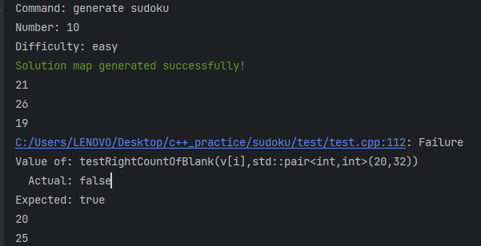
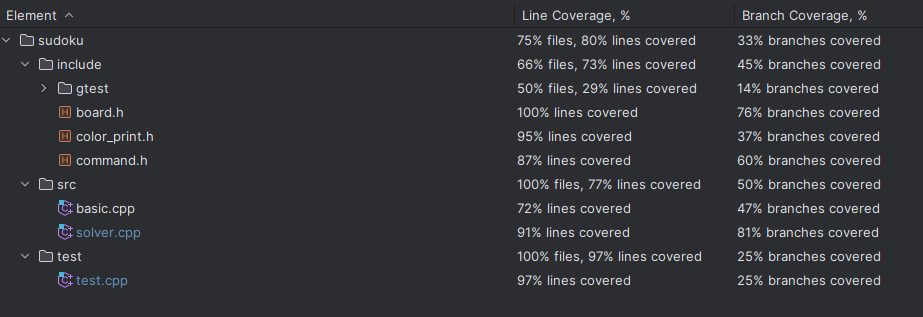

# 南开2020软件工程结对编程

田佳业 田翔宇

| 参数名字 |         参数意义         |    范围限制    |         用法示例          | 用法解释                                                     |
| :------: | :----------------------: | :------------: | :-----------------------: | ------------------------------------------------------------ |
|    -c    |    需要的数独终盘数量    |   1-1000000    |     sudoku.exe -c 20      | 表示生成20个数独终盘                                         |
|    -s    | 需要解的数独棋盘文件路径 | 绝对或相对路径 |  sudoku.exe -s game.txt   | 表示从game.txt读取若干个数独游戏，并给出其解答，生成到sudoku.txt中 |
|    -n    |      需要的游戏数量      |    1-10000     |    sudoku.exe -n 1000     | 表示生成1000个数独游戏                                       |
|    -m    |      生成游戏的难度      |      1-3       |  sudoku.exe -n 1000 -m 1  | 表示生成1000个简单数独游戏，只有m和n一起使用才认为参数无误，否则请报错 |
|    -r    | 生成游戏中挖空的数量范围 |     20-55      | sudoku.exe -n 20 -r 20~55 | 表示生成20个挖空数在20到55之间的数独游戏，只有 r 和 n 一起使用才认为参数无误，否则请报错 |
|    -u    |     生成游戏的解唯一     |                |    sudoku.exe -n 20 -u    | 表示生成20个解唯一的数独游戏，只有u和 n 一起使用才认为参数无误，否则请报错 |

### 参数解析

测试用例

```
    const char *argv10[5] = {"sudoku.exe", "-n", "1000", "-r", "20~60"};
    EXPECT_THROW(parseArgs(5, argv10), ParseArgException);
```

发现一开始忘记对数据范围进行检验，要求里写的清清楚楚。。。

```c++
    const char *argv8[5] = {"sudoku.exe", "-n", "1000", "-m", "0"};
    EXPECT_THROW(parseArgs(3, argv8), ParseArgException);
```

上面这个更蠢，把测试用例写错了。。

### 游戏生成

这个测试测试生成的数独挖空数是否正确，一开始测试不通过



```c++
TEST(GenerateGameTest,TestLevel){
    Command c1(GENERATE_SUDOKU,10,EASY);
    c1.showCommand();
    EXPECT_TRUE(distributeTask(c1));
    std::vector<Board> v;
    v=readBoardsFromFile(GAME_MAP_PATH);
    EXPECT_EQ(v.size(),10);
    for (int i = 0; i < 10; i++) {
        EXPECT_TRUE(testRightCountOfBlank(v[i],std::pair<int,int>(20,32)));
    }
}
```

发现了下面的错误:

挖洞过程的循环应为` while (holeNum--)`

```c++
    for (auto &board: boards) {
        holeNum = dis(gen);
        while (--holeNum) {
            int x = rd0to8();
            int y = rd0to8();
            while (board[x][y] == 0) {
                x = rd0to8();
                y = rd0to8();
            }
            board[x][y] = 0;
        }
    }
```

## 覆盖率测试

对`test.cpp`运行所有测试用例，得到结果如下图所示

